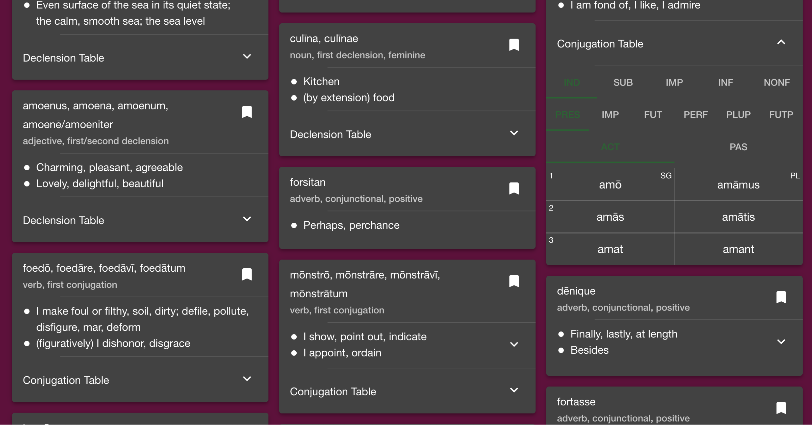
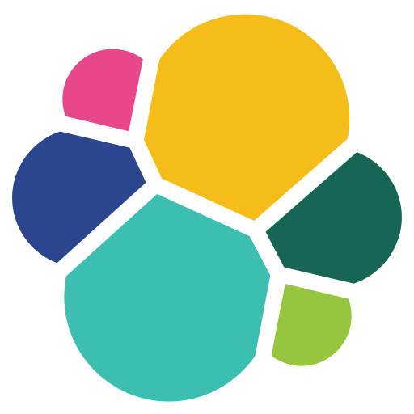
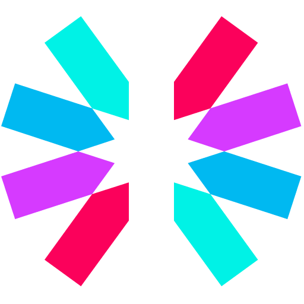
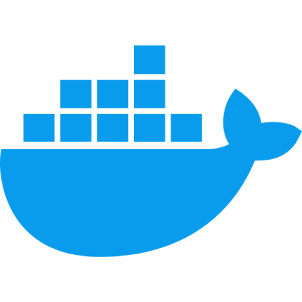
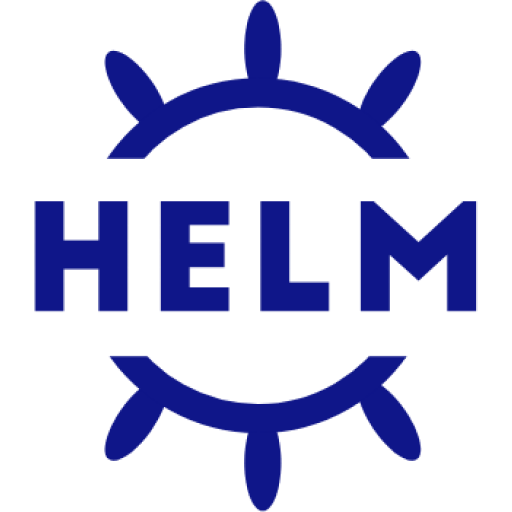
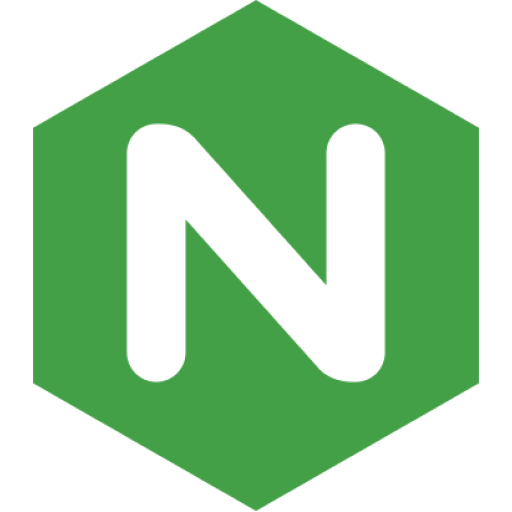
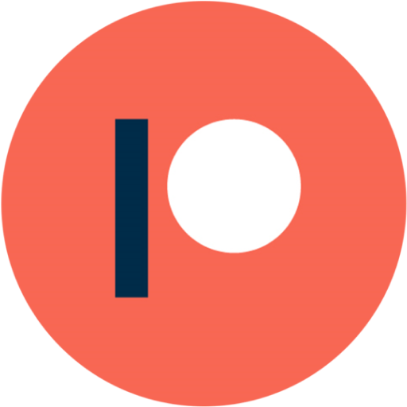
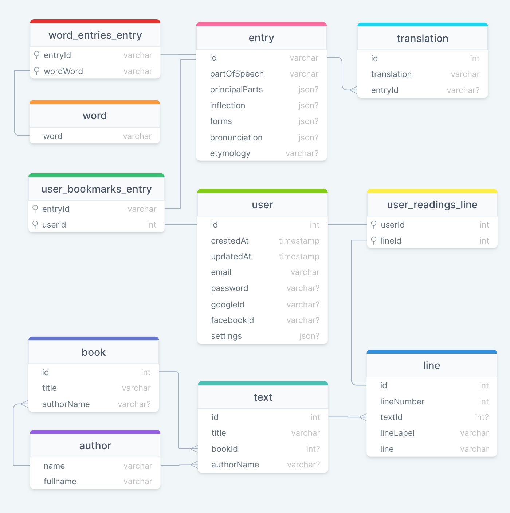

# Lexico

<!-- 

 -->

<a href="https://www.lexicolatin.com">

### Frameworks, Libraries, and Tools

<!-- Generate icon link list from the tools variable in ToolIconGrid.tsx: tools.map((tool) => ``, "").join("\n") -->

### Database Schema

